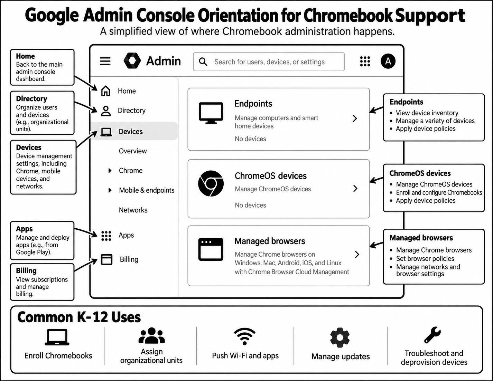
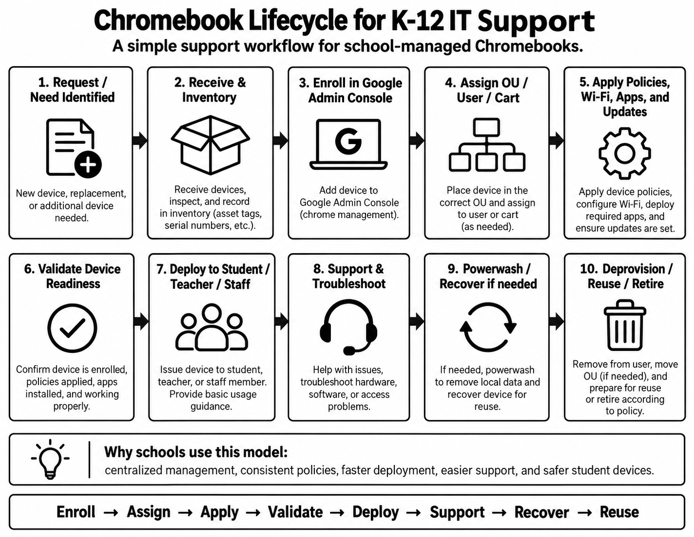

**K-12 Chromebook Support Lab**

Orientation to Google Admin Console, Chromebook lifecycle management, and K–12 endpoint support workflows.

This project documents my preparation for supporting Chromebooks in a K–12 IT environment. I reviewed the Google Admin Console interface and Chromebook management concepts, then mapped those concepts into a practical device lifecycle covering enrollment, assignment, policy application, deployment, troubleshooting, recovery, and retirement.

**Objectives**

- Understand the role of Google Admin Console in Chromebook management.
- Map the Chromebook lifecycle in a K–12 environment.
- Review enrollment, organizational units, policies, Wi-Fi, applications, updates, and device support.
- Connect Chromebook troubleshooting and recovery to an endpoint-support workflow.
- Document the process in a clear, reusable format.

**Google Admin Console Orientation**

This diagram reflects my orientation to the Google Admin Console and the areas most relevant to Chromebook support in a K–12 environment. I focused on understanding how device management, ChromeOS devices, managed browsers, applications, networks, and organizational structure fit together. The main takeaway was that Chromebook administration is built around centralized management rather than configuring each endpoint individually.

**Chromebook Lifecycle Workflow**

This workflow maps how I understand the lifecycle of a managed Chromebook in a school environment. The process begins with identifying the device need, receiving and inventorying the device, enrolling and assigning it, applying policies, validating readiness, deploying it to the user, supporting it throughout its useful life, and eventually recovering, reusing, or retiring it. Building this workflow helped me connect Google Admin concepts with practical day-to-day IT support.

**Lessons Learned**

- Chromebook administration is centered around centralized device and policy management.
- Organizational structure helps administrators apply appropriate settings to different users and devices.
- Chromebook support includes the entire endpoint lifecycle, not just break/fix troubleshooting.
- Powerwash and recovery are useful support tools, but they fit within a larger managed-device process.
- K–12 IT support requires combining device management, networking, user support, documentation, and lifecycle planning.

This lab helped me connect Chromebook support with the broader endpoint lifecycle I already use in IT work: configure, validate, deploy, support, recover, document, and prepare devices for reuse or retirement.

**Navigation**

[`Back to GitHub Profile`](https://www.github.com/cbueker-it)
